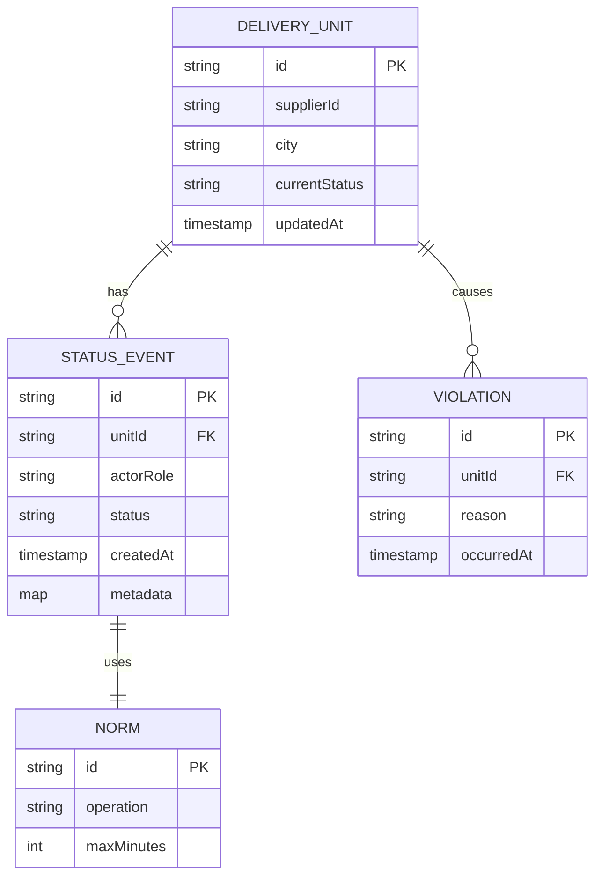
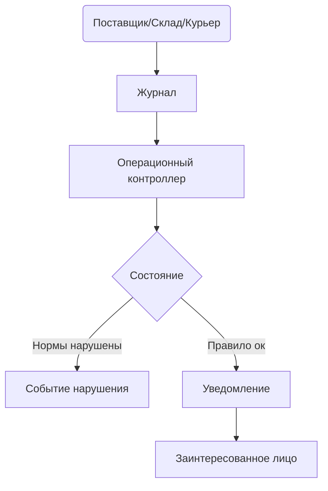

# User Story Document

Примечание: связь с PRD документом для прослеживаемости и согласования указана как \[PRD-2.1]. Архитектура и смежные API/БД будут развиваться в соответствии с цепочкой PRD → User Stories → Архитектура → API → База данных → План разработки.

***

### 1. Project Overview

#### 1.1 Project Information

<table><thead><tr><th width="148.4000244140625">Item</th><th>Description</th></tr></thead><tbody><tr><td>Project Name</td><td>Микросервис журналирования статусов движения товаров в маркетплейсе</td></tr><tr><td>Project Vision</td><td>Обеспечить единый журнал статусов движения товаров по всей цепочке поставок: от поставщика через курьеров маркетплейса и склады до покупателя, с реальным мониторингом сроков выполнения операций и автоматическими мерами при нарушениях сроков. Использовать высоконагруженную архитектуру (highload), масштабируемую по городу/региону и объему событий.</td></tr><tr><td>Project Goals</td><td>- Точная регистрация событий статусов (Принял/Отправил/взял/в работе/отдал) в журнал; - Выявление и автоматическое уведомление о нарушениях сроков; - Рабочее место Операционного контролера для оперативного реагирования; - Поддержка горизонтального масштабирования и наблюдаемости (мониторинг, SLA, логи).</td></tr><tr><td>Target Market</td><td>Маркетплейс с большим количеством городов, поставщиков, складов, курьеров и покупателей; поддержка параллельной обработки множества потоков событий.</td></tr><tr><td>Timeline</td><td>По повинности: минимально жизнеспособный выпуск через 3 месяца, далее ежемесячные релизы с улучшениями качества данных и высокой доступности. Объем проекта на стадии MVP — 6–9 месяцев.</td></tr><tr><td>Stakeholders</td><td>Продуктовый офис, Архитектура и SRE, Разработка (микросервисы-смежники), QA, Операционный контроль, Клиентская поддержка, Бизнес-аналитик.</td></tr></tbody></table>

#### 1.2 User Personas

<table><thead><tr><th width="87.99993896484375">Role ID</th><th>User Role</th><th width="224.7999267578125">Pain Points</th><th width="215.2000732421875">Goals</th><th>Priority</th></tr></thead><tbody><tr><td>UR-001</td><td>Операционный контролер</td><td>Нужно видеть реальное состояние цепочки в реальном времени; быстро реагировать на нарушения сроков</td><td>Быстро обнаруживать нарушения и инициировать меры</td><td>Must</td></tr><tr><td>UR-002</td><td>Складской оператор</td><td>Требуется точное и своевременное обновление статусов на складе</td><td>Обновлять статусы без задержек, минимизировать ошибки</td><td>Should</td></tr><tr><td>UR-003</td><td>Курьер</td><td>Нужно подтверждать начало и завершение доставки, фиксировать задержки</td><td>Передавать корректные статусы в журнал вовремя</td><td>Should</td></tr><tr><td>UR-004</td><td>Системный администратор / DevOps</td><td>Ответственность за стабильность и масштабируемость</td><td>Поддерживать высокую доступность, быстрые развёртывания, мониторинг</td><td>Must</td></tr></tbody></table>

***

### 2. User Stories organized by Epics

Каждая история следует формату: "As a \[Role], I want \[Need], so that \[Value]". Приоритизация и размер спринтов указаны условно и подлежат уточнению в ходе воркшопов.

#### 2.1 Epic: Journal Ingestion and Real-time Journal

| Story ID | Story Title                                | As a \[Role]            | I want \[Need]                                                                       | So that \[Value]                                                           | Priority | Story Points | Epic                                    |
| -------- | ------------------------------------------ | ----------------------- | ------------------------------------------------------------------------------------ | -------------------------------------------------------------------------- | -------- | ------------ | --------------------------------------- |
| US-001   | Журналирование статусов склада             | Складской оператор      | Я хочу публиковать событие статуса "Принял" или "Отправил" для единицы поставки      | Чтобы журнал отражал текущее состояние и можно было отслеживать выполнение | Must     | 5            | Journal Ingestion and Real-time Journal |
| US-002   | Журналирование статусов курьера            | Курьер                  | Я хочу публиковать события статусов "взял", "в работе", "отдал" для единицы поставки | Чтобы журнал отражал прогресс и можно было анализировать задержки          | Must     | 5            | Journal Ingestion and Real-time Journal |
| US-003   | Валидация и идемпотентность событий        | Системный модуль        | Я хочу валидировать схему события и обеспечивать идемпотентность обработки           | Чтобы журнал не дублировался и данные были консистентны                    | Must     | 5            | Journal Ingestion and Real-time Journal |
| US-004   | Реалтайм-дашборд для оперативного контроля | Операционный контролер  | Я хочу видеть реальное распределение статусов по городам/регионам и ключевые каналы  | Чтобы оперативно реагировать на аномалии                                   | Must     | 8            | Journal Ingestion and Real-time Journal |
| US-005   | Конфигурация нормативов времени (SLA)      | Системный администратор | Я хочу настраивать нормативы по времени для операций склада и курьеров               | Чтобы система могла точно определять нарушения и настраивать правила       | Must     | 5            | Journal Ingestion and Real-time Journal |
| US-006   | Тестирование под highload                  | QA-инженер              | Я хочу моделировать большие объемы событий и проверять масштабируемость              | Чтобы убедиться в устойчивости системы под нагрузкой                       | Should   | 5            | Journal Ingestion and Real-time Journal |

#### 2.2 Epic: Operational Controller Workspace

| Story ID | Story Title                           | As a \[Role]           | I want \[Need]                                                       | So that \[Value]                                                | Priority | Story Points | Epic                             |
| -------- | ------------------------------------- | ---------------------- | -------------------------------------------------------------------- | --------------------------------------------------------------- | -------- | ------------ | -------------------------------- |
| US-007   | Оповещения об нарушениях SLA          | Операционный контролер | Я хочу получать уведомления об нарушениях SLA через выбранные каналы | Чтобы быстро реагировать на инциденты                           | Must     | 5            | Operational Controller Workspace |
| US-008   | Управление корректирующими действиями | Операционный контролер | Я хочу создавать задачи/тикеты для устранения нарушений              | Чтобы регламентировать процесс устранения и контроль выполнения | Should   | 4            | Operational Controller Workspace |
| US-009   | Экспорт отчётов по нарушениям         | Операционный контролер | Я хочу экспортировать отчёты по нарушениям за период                 | Чтобы предоставлять руководству и аудиту                        | Should   | 3            | Operational Controller Workspace |
| US-010   | Быстрый доступ к цепочке поставки     | Операционный контролер | Я хочу выполнять ad-hoc запросы к данным о цепочке поставки          | Чтобы проводить расследования и анализировать узкие места       | Should   | 4            | Operational Controller Workspace |

#### 2.3 Epic: SLA & Violations Management

| Story ID | Story Title                               | As a \[Role]                    | I want \[Need]                                                                             | So that \[Value]                                          | Priority | Story Points | Epic                        |
| -------- | ----------------------------------------- | ------------------------------- | ------------------------------------------------------------------------------------------ | --------------------------------------------------------- | -------- | ------------ | --------------------------- |
| US-011   | Определение нормативов и правил нарушений | Продуктовый владелец / Оператор | Я хочу задавать и редактировать правила нарушений, нормы времени и переходы статусов       | Чтобы система соответствовала бизнес-правилам             | Must     | 5            | SLA & Violations Management |
| US-012   | Хранение и маршрутизация нарушений        | Система / Ops                   | Я хочу сохранять нарушения и маршрутизировать уведомления заинтересованным сторонам        | Чтобы нарушение было незамедлительно адресовано           | Must     | 5            | SLA & Violations Management |
| US-013   | Обеспечение HA/Scale для SLA-мониторинга  | DevOps                          | Я хочу обеспечить высокую доступность и горизонтальное масштабирование сервиса мониторинга | Чтобы система держала пиковые нагрузки и не теряла данные | Must     | 8            | SLA & Violations Management |

#### 2.4 Epic: Highload, Observability and Reliability

| Story ID | Story Title                                | As a \[Role]        | I want \[Need]                                                                       | So that \[Value]                                                  | Priority | Story Points | Epic                     |
| -------- | ------------------------------------------ | ------------------- | ------------------------------------------------------------------------------------ | ----------------------------------------------------------------- | -------- | ------------ | ------------------------ |
| US-014   | Расширяемость архитектуры под рост объёмов | Архитектор / DevOps | Я хочу проектировать шардируемость по городам/регионам и потокам событий             | Чтобы система масштабировалась линейно с ростом нагрузки          | Should   | 8            | Highload & Observability |
| US-015   | Метрики, трассировка и алерты              | DevOps / QA         | Я хочу централизованно собирать метрики (latency, throughput) и трассировку запросов | Чтобы оперативно выявлять проблемы и проводить пост-фактум анализ | Must     | 5            | Highload & Observability |

***

### 3. Acceptance Criteria

#### 3.1 Detailed Acceptance Criteria by Story

US-001

* Accept: Payload содержит deliveryUnitId, warehouseId или courierId, status из допустимого набора "Принял", "Отправил"; timestamp присутствует; источник события указан.
* Validation: схема события валидна; полe status соответствует допустимым переходам; idempotent обработка (один и тот же eventId не дублируется).
* Definition of Done: событие успешно записано в журнал; клиентский ack возвращён; журнал обновляется в индексе для быстрых запросов.

US-002

* Аналогично US-001, добавляется поддержка статусов "взял", "в работе", "отдал"; проверка корректности цепочки статусов.

US-003

* Accept: валидация схемы и дедупликация работают; обработчик поддерживает идемпотентность; повторная отправка не меняет журнал повторно.
* DoD: журнал имеет единый источник правды и сопоставимые версии событий.

US-004

* Accept: дашборд показывает текущее распределение по статусам и городам; обновление данных в реальном времени (частота обновления <= N секунд); фильтры по городам, поставщикам, статусам работают.
* DoD: данные корректно отражаются в UI; присутствуют KPI (например, доля просроченных операций).

US-005

* Accept: возможность задания нормативов по времени на операции склада (Принял/Отправил) и курьеров (взял/в работе/отдал) через конфигурационный интерфейс; изменения немедленно влияют на вычисление нарушений.
* DoD: правила валидны; изменения применяются без перезапуска сервиса.

US-006

* Accept: сценарии highload: имитация потока N событий/сек, корректная обработка, без потери данных; мониторинг задержек и ошибок.
* DoD: тестовое окружение подтверждает требуемые характеристики под заданной нагрузкой.

US-007

* Accept: уведомления приходят через выбранные каналы (email, Slack, push); для каждого типа нарушения настраиваются получатели.
* DoD: уведомления создаются и доставляются; дубликаты уведомлений исключены.

US-008

* Accept: создание corrective action тикета из нарушений; тикет связывается с конкретной записью журнала; статус тикета виден в UI.
* DoD: тикет может быть закрыт/обновлен с журналом аудита.

US-009

* Accept: экспорт отчетов по нарушениям за выбранный диапазон, формат CSV/Excel; данные корректны и соединены с деталями событий.
* DoD: экспорт гарантирован и повторяем.

US-010

* Accept: быстрый доступ к цепочке поставки по deliveryUnitId; возможны фильтры по времени, статусу, городу; выводит путь через все стадии.
* DoD: быстрый ответ (< X мс) на запросы.

US-011

* Accept: нормативы можно добавлять/редактировать; правила переходов статусов соответствуют бизнес-процессам; изменения доступны для всех потребителей.
* DoD: версия правил сохраняется, аудит изменений включён.

US-012

* Accept: нарушение фиксируется с временной меткой, связывается с конкретной единицей, уведомляется ответственный участник; нарушение хранится в журнале Violations.
* DoD: отчетность по нарушениям корректна, журнал доступен.

US-013

* Accept: система поддерживает горизонтальное масштабирование (добавление нод, балансировка); отказоустойчивость; репликация и консистентность данных.
* DoD: в тестовом окружении допускается failover и масштабирование без потери данных.

US-014

* Accept: возможность включать/выключать экспериментальные функции; сборка метрик и трассировки; конфигурация через feature flags.
* DoD: фичи можно безопасно тестировать в проде без влияния на основной функционал.

US-015

* Accept: сбор и корреляция метрик (latency, throughput, error rate), отображение в dashboards; трассировка по микросервисам.
* DoD: данные валидны, dashboards доступны.

***

### 4. Priority Matrix

#### 4.1 Priority vs Effort Matrix

| Priority    | Low Effort (1-3)       | Medium Effort (4-6)    | High Effort (7-10)             |
| ----------- | ---------------------- | ---------------------- | ------------------------------ |
| Must Have   | US-001, US-002, US-003 | US-004, US-005, US-007 | US-006, US-012, US-013, US-014 |
| Should Have | US-008, US-009         | US-010, US-011         | -                              |
| Could Have  | US-015                 | -                      | -                              |
| Won’t Have  | -                      | -                      | -                              |

#### 4.2 Release Planning Matrix

| Release     | Epic                                    | Stories Included                       | Total Story Points | Priority | Target Date |
| ----------- | --------------------------------------- | -------------------------------------- | ------------------ | -------- | ----------- |
| Release 1.0 | Journal Ingestion and Real-time Journal | US-001, US-002, US-003, US-004, US-005 | 26                 | Must     | Month 1     |
| Release 1.1 | Operational Controller Workspace        | US-007, US-008, US-009, US-010         | 20                 | Must     | Month 2     |
| Release 1.2 | SLA & Violations Management             | US-011, US-012                         | 10                 | Must     | Month 3     |
| Release 2.0 | Highload, Observability                 | US-013, US-014, US-015                 | 16                 | Should   | Month 4     |

Примечание: данные планы являются ориентировочными и подлежат корректировке после воркшопа с заинтересованными сторонами. В рамках traceability документ будет закреплена связь с архитектурной документацией \[ARCH-2.x], API \[API-2.x], и моделью БД \[DB-2.x].

***

### 5. Visualization, Statistics и Версионирование

#### 5.1 Flowcharts и Relationship Diagrams (Mermaid)

* Поток событий (от источника до журнала и далее к Операционному Контролеру)

```mermaid
graph LR
  subgraph Источники событий
    Pоставщик((Поставщик))
    Склада((Склад, статус: Принял/Отправил))
    Курьер((Курьер, статусы: взял / в работе / отдал))
  end
  subgraph Журнал
    Журнал((Журнал статусов))
  end
  subgraph Контроль
    ОК((Операционный контроллер))
    Виявление((Система выявления нарушений))
    Каналы((Оповещения: email/Slack/Push))
  end
  Pоставщик --Event--> Журнал
  Склада --Event--> Журнал
  Курьер --Event--> Журнал
  Журнал --> ОК
  ОК --> Виявление
  Виявление --> Каналы
  Каналы --> Журнал
```

* Модель сущностей и связи



* Диаграмма потоков вдоль жизненного цикла единицы поставки



#### 5.2 Статистические таблицы

* Coverage по ролям и стадиям

| Epic / Story                            | Role Coverage (число историй)                      | Stage Coverage (requirements/design/implementation/QA) |
| --------------------------------------- | -------------------------------------------------- | ------------------------------------------------------ |
| Journal Ingestion and Real-time Journal | UR-001, UR-002, UR-003, UR-004, UR-005, UR-006 (6) | Requirements 2, Design 2, Implementation 2, QA 0       |
| Operational Controller Workspace        | UR-007, UR-008, UR-009, UR-010 (4)                 | Req 1, Design 1, Implementation 1, QA 1                |
| SLA & Violations Management             | UR-011, UR-012, UR-013 (3)                         | Req 1, Design 1, Implementation 1, QA 0                |
| Highload & Observability                | UR-013, UR-014, UR-015 (3)                         | Req 1, Design 1, Implementation 1, QA 1                |

* Версионирование требований

| Версия | Дата       | Основные изменения                                      | Ответственный | Статус    |
| ------ | ---------- | ------------------------------------------------------- | ------------- | --------- |
| 1.0    | 2025-01-15 | Инициализация документа; базовые истории                | PM            | Draft     |
| 1.1    | 2025-02-28 | Добавлены US-005, US-010; обновлены acceptance criteria | PM / Eng Lead | In Review |
| 1.2    | 2025-04-20 | Расширение по Highload; включение US-014/US-015         | Архитектор    | Approved  |

***

### 6. Cross-Document References и Traceability

* Этот документ связан с PRD: \[PRD-2.1].
* Все функциональные единицы согласованы с Архитектурой \[ARCH-2.x], API \[API-2.x], БД \[DB-2.x] и Планом разработки \[PLAN-2.x].
* Цепочка: PRD → User Stories → Архитектура → API → БД → План разработки.
* В процессе разработки документ будет обновляться с версионной историей и сравнительным анализом версий, чтобы легко отслеживать изменения и обоснование решений.

***

### 7. Task Execution Guidance

1. Research and Collection

* Собрать информацию о роли операционного контроля, требования к журналу и SLA, а также объёме событий.
* Уточнить нормативы времени для операций склада и курьеров.

2. Template Generation

* Использовать приведённый выше шаблон и адаптировать под конкретный команды и бизнес-процессы.

3. Refinement and Review

* Организовать сессии обзора с Product, Design, Engineering, QA, Ops.
* Внести правки на основании отзывов и добавить недостающие сценарии.

4. Final Organization

* Проверить полноту документов: покрытия ролей, стадий, Acceptance Criteria, диаграммы.
* Включить диаграммы Mermaid и таблицы под визуализацию.
* Обновить версионность и подготовить релизные заметки.
