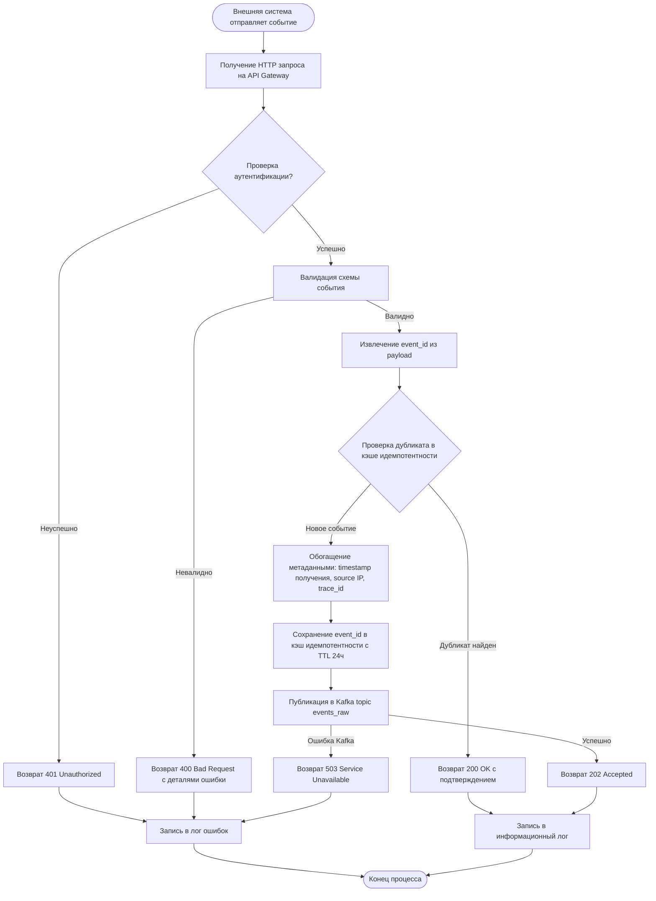
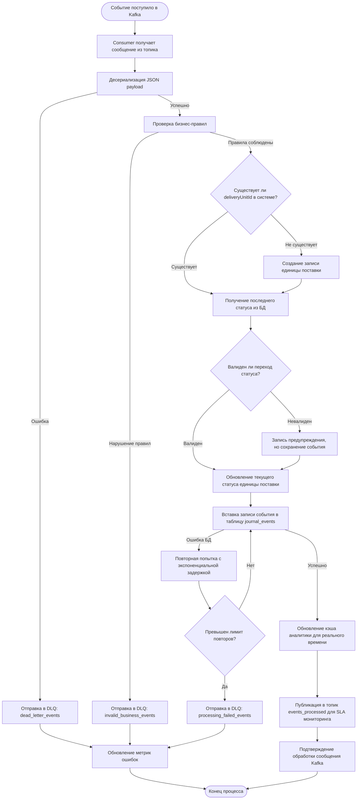
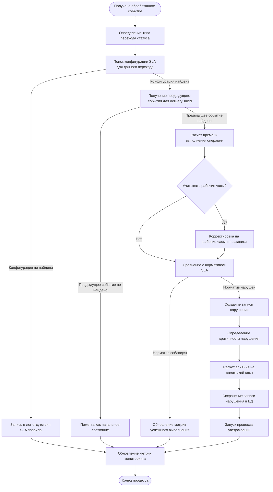
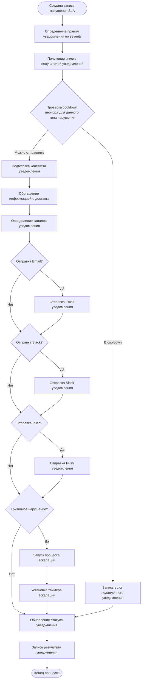
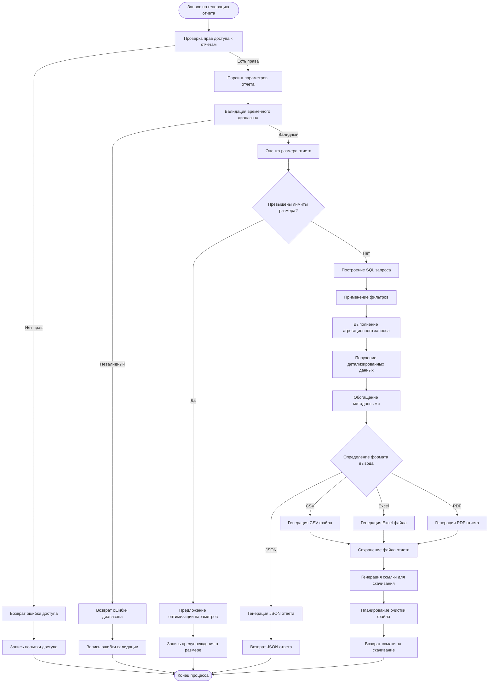
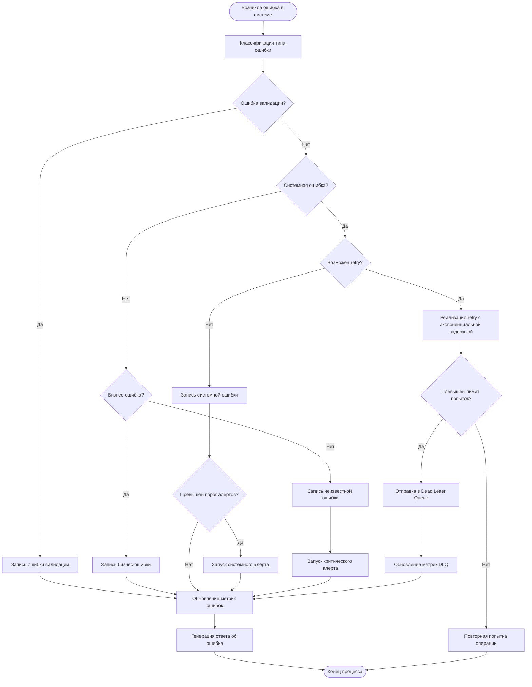
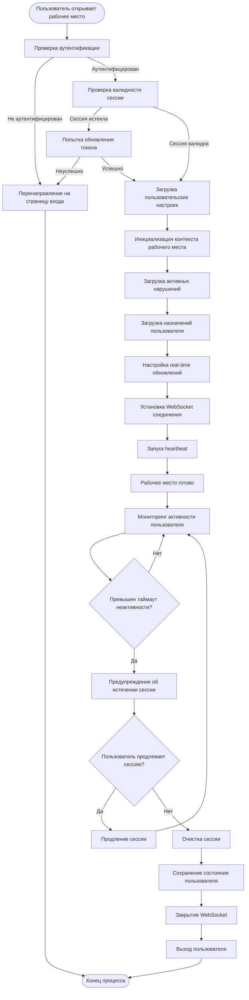

# Business Process Design

### 1. Основной бизнес-процесс приема и журналирования событий статусов

#### 1.1 Процесс приема события статуса от внешних систем

Данный процесс реализует \[US-001], \[US-002], \[US-003] и соответствует \[UC-F-001] из архитектурного документа.



#### 1.2 Структуры данных для процесса приема событий

```typescript
// Входящее событие статуса
interface IncomingStatusEvent {
  deliveryUnitId: string;        // UUID единицы поставки
  actor: {
    type: 'WAREHOUSE' | 'COURIER' | 'SUPPLIER';
    id: string;                  // ID конкретного склада/курьера
    name?: string;               // Имя для отображения
    location?: {
      city: string;
      region?: string;
      coordinates?: {
        lat: number;
        lng: number;
      };
    };
  };
  status: string;                // "Принял", "Отправил", "взял", "в работе", "отдал"
  timestamp: string;             // ISO 8601 UTC
  event_id: string;              // UUID для идемпотентности
  metadata?: {
    reason_code?: string;        // Код причины (опционально)
    notes?: string;              // Комментарии
    previous_attempt?: boolean;   // Признак повторной попытки
  };
}

// Обогащенное событие для внутренней обработки
interface EnrichedStatusEvent extends IncomingStatusEvent {
  received_at: string;           // Время получения системой
  source_ip: string;             // IP источника
  trace_id: string;              // Идентификатор трассировки
  processing_region: string;     // Регион обработки
}
```

***

### 2. Бизнес-процесс обработки и хранения событий в журнале

#### 2.1 Процесс асинхронной обработки событий

Данный процесс реализует \[US-003] и соответствует \[UC-F-002] из архитектурного документа.



#### 2.2 Структуры данных для журнала событий

```typescript
// Запись единицы поставки
interface DeliveryUnit {
  id: string;                    // UUID
  supplier_id: string;           // ID поставщика
  current_status: string;        // Текущий статус
  current_actor_type: string;    // Тип текущего актора
  current_actor_id: string;      // ID текущего актора
  created_at: string;            // Время создания записи
  updated_at: string;            // Время последнего обновления
  destination_city: string;      // Город назначения
  estimated_delivery: string;    // Плановое время доставки
  metadata: {
    customer_id?: string;
    priority_level?: number;
    special_handling?: boolean;
  };
}

// Запись события в журнале
interface JournalEventRecord {
  id: string;                    // UUID записи
  delivery_unit_id: string;      // Ссылка на единицу поставки
  event_id: string;              // Оригинальный event_id
  actor_type: string;            // WAREHOUSE, COURIER, SUPPLIER
  actor_id: string;              // ID актора
  actor_name: string;            // Имя актора
  status: string;                // Статус события
  timestamp: string;             // Время события (от источника)
  received_at: string;           // Время получения системой
  processed_at: string;          // Время обработки
  trace_id: string;              // Трассировка
  location_data: {
    city: string;
    region?: string;
    coordinates?: {
      lat: number;
      lng: number;
    };
  };
  metadata: object;              // Дополнительные данные
}
```

***

### 3. Бизнес-процесс SLA мониторинга и выявления нарушений

#### 3.1 Процесс анализа соблюдения SLA

Данный процесс реализует \[US-005], \[US-011], \[US-012] и соответствует \[UC-F-003] из архитектурного документа.



#### 3.2 Структуры данных для SLA конфигурации и нарушений

```typescript
// Конфигурация SLA
interface SLAConfiguration {
  id: string;                    // UUID конфигурации
  operation_type: string;        // "WAREHOUSE_RECEIVE", "WAREHOUSE_SHIP", "COURIER_PICKUP", etc.
  from_status: string;           // Исходный статус
  to_status: string;             // Целевой статус
  max_duration_minutes: number;  // Максимальное время в минутах
  apply_working_hours: boolean;  // Учитывать рабочие часы
  conditions: {
    actor_type?: string;         // Ограничение по типу актора
    city?: string[];             // Ограничение по городам
    priority_level?: number;     // Ограничение по приоритету
    special_handling?: boolean;  // Особая обработка
  };
  effective_from: string;        // Дата начала действия
  effective_to?: string;         // Дата окончания действия
  created_by: string;            // Создатель правила
  version: number;               // Версия конфигурации
}

// Запись нарушения SLA
interface SLAViolationRecord {
  id: string;                    // UUID нарушения
  delivery_unit_id: string;      // Единица поставки
  sla_config_id: string;         // Конфигурация SLA
  violation_type: 'SLA_EXCEEDED' | 'CRITICAL_DELAY' | 'BUSINESS_HOURS_EXCEEDED';
  from_event_id: string;         // ID исходного события
  to_event_id: string;           // ID целевого события
  expected_duration_minutes: number;  // Ожидаемое время
  actual_duration_minutes: number;    // Фактическое время
  delay_minutes: number;         // Величина задержки
  severity: 'LOW' | 'MEDIUM' | 'HIGH' | 'CRITICAL';
  impact_score: number;          // Оценка влияния (0-100)
  occurred_at: string;           // Время выявления нарушения
  detected_at: string;           // Время детектирования системой
  status: 'NEW' | 'ACKNOWLEDGED' | 'IN_PROGRESS' | 'RESOLVED' | 'CLOSED';
  assigned_to?: string;          // Назначено пользователю
  resolution_notes?: string;     // Заметки по решению
  metadata: {
    affected_customer_count?: number;
    estimated_delivery_delay?: number;
    root_cause_category?: string;
  };
}
```

***

### 4. Бизнес-процесс уведомлений и эскалации

#### 4.1 Процесс отправки уведомлений о нарушениях

Данный процесс реализует \[US-007] и соответствует \[UC-F-004] из архитектурного документа.



#### 4.2 Структуры данных для уведомлений

```typescript
// Правила уведомлений
interface NotificationRule {
  id: string;
  name: string;
  trigger_conditions: {
    violation_severity: string[];
    violation_types: string[];
    actor_types: string[];
    cities: string[];
    time_of_day?: {
      start: string;             // "09:00"
      end: string;               // "18:00"
    };
  };
  recipients: {
    roles: string[];             // ["OPERATIONS_CONTROLLER", "SHIFT_MANAGER"]
    specific_users: string[];    // Конкретные пользователи
    escalation_chain: {
      level: number;
      delay_minutes: number;
      recipients: string[];
    }[];
  };
  channels: {
    email: boolean;
    slack: boolean;
    push: boolean;
    sms: boolean;
  };
  cooldown_minutes: number;      // Минимальный интервал между уведомлениями
  active: boolean;
}

// Контекст уведомления
interface NotificationContext {
  violation_id: string;
  delivery_unit_id: string;
  violation_summary: {
    type: string;
    severity: string;
    delay_minutes: number;
    expected_time: string;
    actual_time: string;
  };
  delivery_info: {
    customer_id?: string;
    destination_city: string;
    current_actor: string;
    estimated_delivery: string;
  };
  suggested_actions: string[];   // Рекомендуемые действия
  deep_link_url: string;         // Ссылка в UI контроллера
  timestamp: string;
}
```

***

### 5. Бизнес-процесс управления корректирующими действиями

#### 5.1 Процесс создания и отслеживания корректирующих действий

Данный процесс реализует \[US-008] и частично \[UC-F-004], \[UC-F-005] из архитектурного документа.

```mermaid
flowchart TD
    START([Операционный контролер инициирует действие]) --> VALIDATE_USER_PERMISSIONS[Проверка прав пользователя]
    VALIDATE_USER_PERMISSIONS -->|Нет прав| ERROR_UNAUTHORIZED[Возврат ошибки авторизации]
    VALIDATE_USER_PERMISSIONS -->|Есть права| VALIDATE_ACTION_REQUEST[Валидация запроса на создание действия]
    VALIDATE_ACTION_REQUEST -->|Невалидный| ERROR_VALIDATION_ACTION[Возврат ошибки валидации]
    VALIDATE_ACTION_REQUEST -->|Валидный| DETERMINE_ACTION_TYPE[Определение типа корректирующего действия]
    DETERMINE_ACTION_TYPE --> GET_VIOLATION_CONTEXT[Получение контекста нарушения]
    GET_VIOLATION_CONTEXT --> SUGGEST_ACTION_TEMPLATES[Предложение шаблонов действий]
    SUGGEST_ACTION_TEMPLATES --> CREATE_ACTION_RECORD[Создание записи корректирующего действия]
    CREATE_ACTION_RECORD --> ASSIGN_ACTION{Назначение исполнителя}
    ASSIGN_ACTION -->|Самому себе| ASSIGN_TO_CREATOR[Назначение создателю]
    ASSIGN_ACTION -->|Другому пользователю| ASSIGN_TO_USER[Назначение указанному пользователю]
    ASSIGN_ACTION -->|Команде| ASSIGN_TO_TEAM[Назначение команде]
    ASSIGN_TO_CREATOR --> DETERMINE_INTEGRATION_TYPE[Определение типа внешней интеграции]
    ASSIGN_TO_USER --> SEND_ASSIGNMENT_NOTIFICATION[Отправка уведомления о назначении]
    ASSIGN_TO_TEAM --> SEND_ASSIGNMENT_NOTIFICATION
    SEND_ASSIGNMENT_NOTIFICATION --> DETERMINE_INTEGRATION_TYPE
    DETERMINE_INTEGRATION_TYPE --> CREATE_EXTERNAL_TICKET{Создание внешнего тикета?}
    CREATE_EXTERNAL_TICKET -->|Да| INTEGRATE_TICKETING_SYSTEM[Интеграция с системой тикетинга]
    CREATE_EXTERNAL_TICKET -->|Нет| SET_INTERNAL_TRACKING[Установка внутреннего отслеживания]
    INTEGRATE_TICKETING_SYSTEM --> STORE_EXTERNAL_REFERENCE[Сохранение ссылки на внешний тикет]
    STORE_EXTERNAL_REFERENCE --> UPDATE_ACTION_STATUS[Обновление статуса действия на "Assigned"]
    SET_INTERNAL_TRACKING --> UPDATE_ACTION_STATUS
    UPDATE_ACTION_STATUS --> SETUP_FOLLOW_UP_SCHEDULE[Настройка расписания контроля]
    SETUP_FOLLOW_UP_SCHEDULE --> RETURN_ACTION_DETAILS[Возврат деталей созданного действия]
    ERROR_UNAUTHORIZED --> LOG_SECURITY_EVENT[Запись события безопасности]
    ERROR_VALIDATION_ACTION --> LOG_VALIDATION_ERROR[Запись ошибки валидации]
    LOG_SECURITY_EVENT --> END([Конец процесса])
    LOG_VALIDATION_ERROR --> END
    RETURN_ACTION_DETAILS --> END
```

#### 5.2 Структуры данных для корректирующих действий

```typescript
// Корректирующее действие
interface CorrectiveAction {
  id: string;                    // UUID действия
  violation_id: string;          // Связанное нарушение
  delivery_unit_id: string;      // Единица поставки
  action_type: 'MANUAL_INTERVENTION' | 'PROCESS_ESCALATION' | 'SYSTEM_ADJUSTMENT' | 'COMMUNICATION' | 'INVESTIGATION';
  title: string;                 // Краткое описание действия
  description: string;           // Подробное описание
  priority: 'LOW' | 'MEDIUM' | 'HIGH' | 'URGENT';
  status: 'NEW' | 'ASSIGNED' | 'IN_PROGRESS' | 'WAITING_EXTERNAL' | 'COMPLETED' | 'CANCELLED';
  created_by: string;            // Создатель действия
  assigned_to?: string;          // Назначено пользователю
  assigned_team?: string;        // Назначено команде
  created_at: string;            // Время создания
  due_date?: string;             // Срок выполнения
  started_at?: string;           // Время начала работы
  completed_at?: string;         // Время завершения
  external_ticket?: {
    system: string;              // "JIRA", "ServiceNow", etc.
    ticket_id: string;           // ID во внешней системе
    ticket_url: string;          // Прямая ссылка
  };
  progress_updates: {
    timestamp: string;
    user_id: string;
    status_change?: string;
    notes: string;
    attachments?: string[];
  }[];
  outcome?: {
    resolution_type: 'RESOLVED' | 'MITIGATED' | 'ESCALATED' | 'NO_ACTION_NEEDED';
    resolution_notes: string;
    lessons_learned?: string;
    preventive_measures?: string[];
  };
}

// Шаблон действия
interface ActionTemplate {
  id: string;
  name: string;
  description: string;
  action_type: string;
  applicable_violation_types: string[];
  applicable_severities: string[];
  template_steps: {
    order: number;
    step_description: string;
    estimated_duration_minutes: number;
    required_permissions: string[];
  }[];
  success_criteria: string[];
  escalation_triggers: {
    condition: string;
    escalation_action: string;
  }[];
}
```

***

### 6. Бизнес-процесс отчетности и аналитики

#### 6.1 Процесс генерации отчетов по нарушениям

Данный процесс реализует \[US-009] и соответствует \[UC-F-005] из архитектурного документа.



#### 6.2 Структуры данных для отчетности

```typescript
// Параметры запроса отчета
interface ReportRequest {
  report_type: 'VIOLATIONS_SUMMARY' | 'DETAILED_VIOLATIONS' | 'SLA_PERFORMANCE' | 'ACTOR_PERFORMANCE';
  date_range: {
    from: string;                // ISO 8601
    to: string;                  // ISO 8601
  };
  filters: {
    cities?: string[];
    violation_types?: string[];
    severities?: string[];
    actor_types?: string[];
    actor_ids?: string[];
    delivery_unit_ids?: string[];
    status?: string[];
  };
  grouping?: {
    by_city: boolean;
    by_actor: boolean;
    by_day: boolean;
    by_hour: boolean;
  };
  output_format: 'CSV' | 'EXCEL' | 'PDF' | 'JSON';
  include_metadata: boolean;
  max_records?: number;
}

// Данные отчета по нарушениям
interface ViolationReportData {
  summary: {
    total_violations: number;
    violations_by_severity: Record<string, number>;
    violations_by_type: Record<string, number>;
    average_delay_minutes: number;
    most_affected_cities: {
      city: string;
      violation_count: number;
    }[];
    worst_performing_actors: {
      actor_id: string;
      actor_name: string;
      violation_count: number;
      average_delay: number;
    }[];
  };
  detailed_violations: {
    violation_id: string;
    delivery_unit_id: string;
    occurred_at: string;
    severity: string;
    delay_minutes: number;
    actor_name: string;
    city: string;
    status: string;
    resolution_time_minutes?: number;
  }[];
  trends: {
    daily_violation_counts: {
      date: string;
      count: number;
    }[];
    hourly_patterns: {
      hour: number;
      average_violations: number;
    }[];
  };
  metadata: {
    generated_at: string;
    generated_by: string;
    report_parameters: ReportRequest;
    data_freshness: string;      // Насколько свежие данные
  };
}
```

***

### 7. Процесс обработки ошибок и исключительных ситуаций

#### 7.1 Единый процесс обработки системных ошибок

Данный процесс обеспечивает надежность всех вышеперечисленных бизнес-процессов.



#### 7.2 Структуры данных для обработки ошибок

```typescript
// Запись об ошибке
interface ErrorRecord {
  error_id: string;              // UUID ошибки
  error_type: 'VALIDATION' | 'SYSTEM' | 'BUSINESS' | 'INTEGRATION' | 'SECURITY';
  error_code: string;            // Код ошибки (E1001, E2002, etc.)
  severity: 'LOW' | 'MEDIUM' | 'HIGH' | 'CRITICAL';
  service_component: string;     // Компонент, где произошла ошибка
  operation_context: string;     // Контекст операции
  error_message: string;         // Сообщение об ошибке
  error_details: {
    stack_trace?: string;
    input_data?: object;
    system_state?: object;
    correlation_id?: string;
  };
  occurred_at: string;           // Время возникновения
  resolved_at?: string;          // Время решения
  retry_count: number;           // Количество попыток
  resolution_action?: string;    // Действие по решению
  affected_resources: string[];  // Затронутые ресурсы
}

// Конфигурация retry логики
interface RetryConfiguration {
  operation_type: string;
  max_retry_attempts: number;
  initial_delay_ms: number;
  max_delay_ms: number;
  backoff_multiplier: number;
  retry_on_errors: string[];     // Коды ошибок для retry
  circuit_breaker?: {
    failure_threshold: number;
    recovery_timeout_ms: number;
    half_open_max_calls: number;
  };
}
```

***

### 8. Процесс управления жизненным циклом сессий и контекста

#### 8.1 Процесс управления пользовательскими сессиями для UI контроллера

Данный процесс обеспечивает \[US-004], \[US-008], \[US-009], \[US-010] и соответствует \[UC-F-005].



#### 8.2 Структуры данных для управления сессиями

```typescript
// Контекст пользовательской сессии
interface UserSessionContext {
  session_id: string;            // UUID сессии
  user_id: string;               // ID пользователя
  user_role: string;             // Роль пользователя
  permissions: string[];         // Разрешения
  workspace_preferences: {
    default_city_filter?: string[];
    default_severity_filter?: string[];
    refresh_interval_seconds: number;
    notifications_enabled: boolean;
    dashboard_layout: object;
  };
  active_assignments: {
    violation_id: string;
    assigned_at: string;
    priority: string;
  }[];
  current_filters: {
    cities: string[];
    date_range: {
      from: string;
      to: string;
    };
    severities: string[];
    statuses: string[];
  };
  websocket_connection_id?: string;
  last_activity: string;
  session_expires_at: string;
  created_at: string;
}

// Состояние рабочего места
interface WorkspaceState {
  user_session: UserSessionContext;
  dashboard_data: {
    total_active_violations: number;
    my_assigned_violations: number;
    critical_violations: number;
    violations_trend: {
      timestamp: string;
      count: number;
    }[];
    top_affected_cities: {
      city: string;
      violation_count: number;
    }[];
  };
  real_time_updates: {
    last_update: string;
    pending_notifications: {
      type: string;
      message: string;
      timestamp: string;
    }[];
  };
  ui_state: {
    active_tab: string;
    selected_violation_id?: string;
    modal_states: Record<string, boolean>;
    table_sort_order: Record<string, 'asc' | 'desc'>;
    pagination_state: Record<string, {
      page: number;
      page_size: number;
    }>;
  };
}
```

***

### Cross-Document References и версионирование

**Связь с документами:**

* \[PRD-2.1] — соответствие функциональным требованиям
* \[US-001…US-015] — реализация пользовательских историй
* \[ARCH-2.1] — архитектурная поддержка бизнес-процессов

**Версионность:**

* Версия 1.0: Базовые процессы для MVP
* Версия 1.1: Добавление процессов эскалации и интеграции с внешними системами
* Версия 1.2: Расширение аналитики и отчетности

**Следующие документы в цепочке:**

* API Design Document \[API-2.x]
* Database Design Document \[DB-2.x]
* Development Plan \[PLAN-2.x]
