# System Architecture Design

### 1. System Overview

**System Name:** Tracking Journal Microservice (ARCH-2.1)\
**System Function Summary:** Централизованный высоконагруженный микросервис для приёма, хранения, анализа и визуализации статусов движения товаров, обеспечивающий контроль SLA складов и курьеров для Операционного контролера.

**Main Modules:**

1. **Сбор событий статусов (Ingestion Service)** — \[UC-F-001], \[US-001], \[US-002], \[US-003]
2. **Хранилище журнала и API чтения (Journal Store & Query API)** — \[UC-F-002], \[US-004], \[US-010]
3. **Модуль SLA-мониторинга и нарушений (SLA Monitor)** — \[UC-F-003], \[US-005], \[US-011], \[US-012]
4. **Уведомления и оркестрация действий (Notification & Actions)** — \[UC-F-004], \[US-007], \[US-008], \[US-009]
5. **Рабочее место Операционного контролера (Controller UI)** — \[UC-F-005], \[US-004], \[US-008], \[US-009], \[US-010]
6. **Подсистема Observability & Highload (Observability Platform)** — \[UC-F-006], \[US-006], \[US-013], \[US-014], \[US-015]

**Ключевые сценарии:**

* Регистрация статуса склада или курьера и запись в журнал \[US-001], \[US-002]
* Идентификация нарушения SLA и уведомление ответственных \[US-005], \[US-007], \[US-012]
* Операционный контроллер анализирует цепочку поставки и инициирует корректирующее действие \[US-004], \[US-008], \[US-010]
* Экспорт отчета по нарушениям для аудита \[US-009]
* Масштабирование системы при росте событий и пользователей \[US-006], \[US-013], \[US-014], \[US-015]

**Характеристики системы:**

* Высокая пропускная способность (10K–100K событий/сек) с горизонтальным масштабированием
* Идемпотентная обработка событий и консистентное хранение
* SLA-мониторинг в реальном времени с задержкой < 1 мин.
* Наблюдаемость уровня enterprise (метрики, логи, трассировка)
* Безопасность: RBAC, шифрование, аудит действий

***

### 2. Overall Architecture

#### 2.1 System Structure Diagram (God's View)

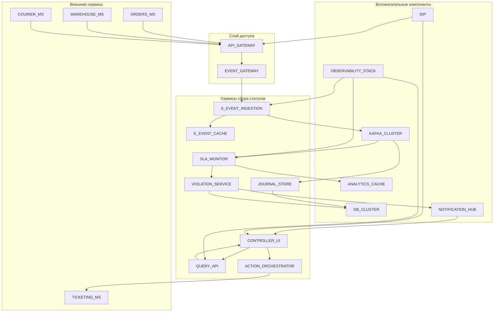

#### 2.2 Functional Module Diagram

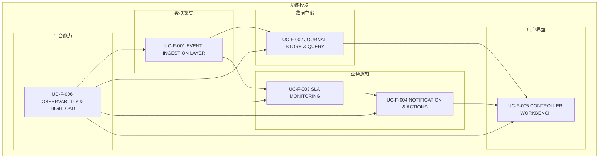

***

### 3. Business Process Design

#### 3.1 Процесс обработки события статуса \[US-001], \[US-002], \[UC-F-001]

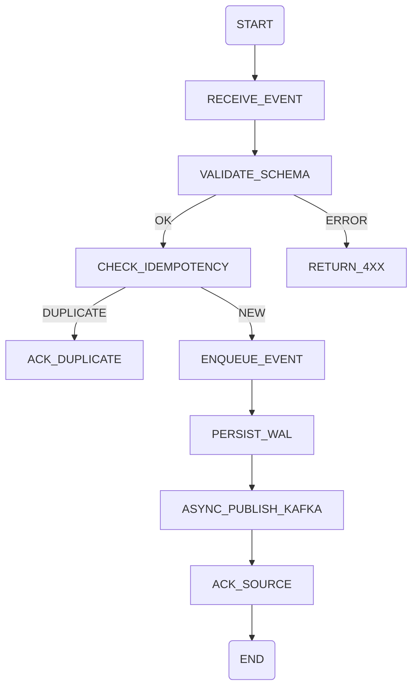

#### 3.2 Процесс реагирования на нарушение SLA \[US-005], \[US-007], \[US-012], \[UC-F-003], \[UC-F-004]

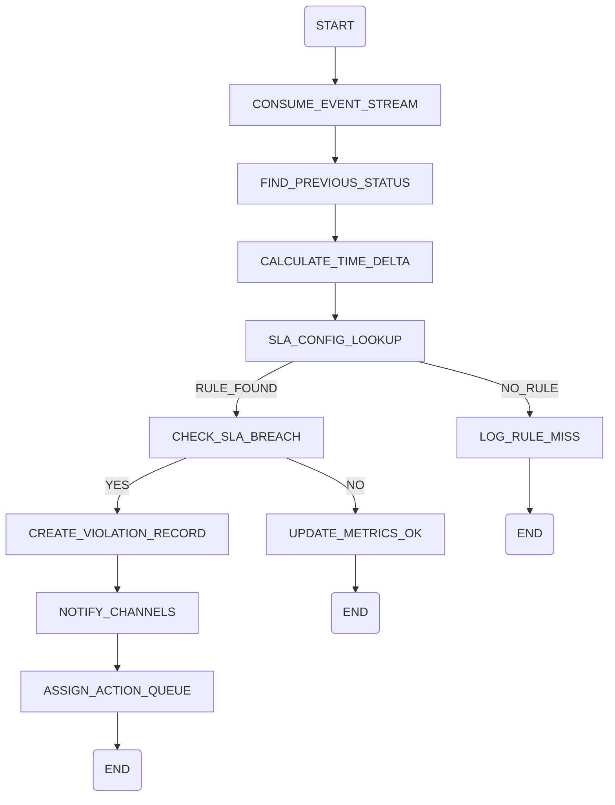

***

### 4. State Transition Design

#### 4.1 Статусы единицы поставки \[US-001—US-004], \[UC-F-002], \[UC-F-003]

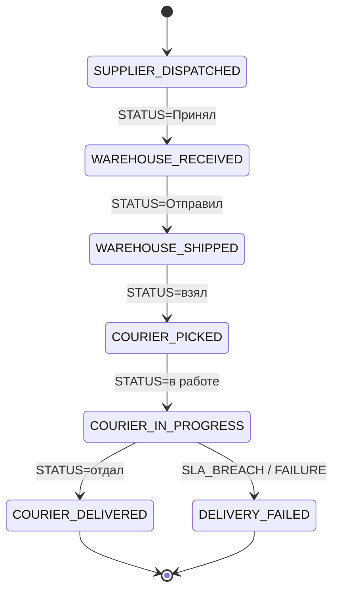

***

### 5. Sequence Diagram Design

#### 5.1 Обработка нарушения и создание корректирующего действия \[US-007], \[US-008], \[UC-F-003], \[UC-F-004], \[UC-F-005]

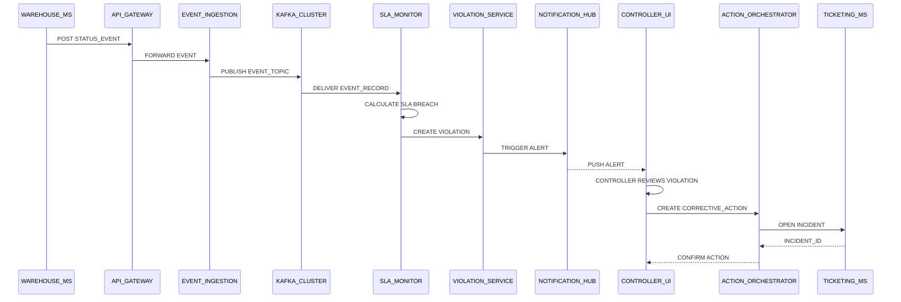

***

### 6. Data Flow Design

#### 6.1 System Data Flow Diagram \[PRD-2.1], \[US-001—US-015]

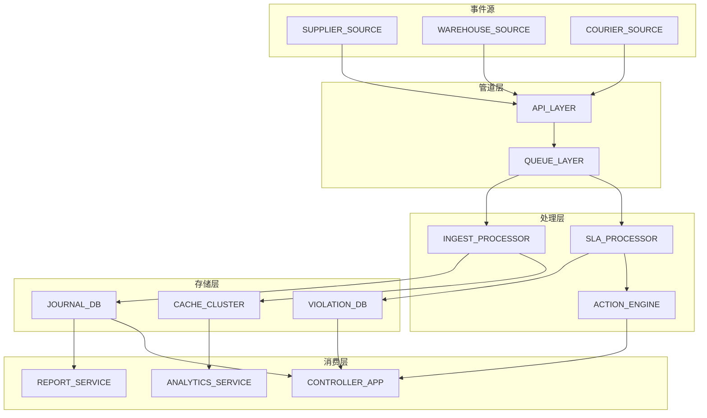

***

### 7. Error Handling Design

#### 7.1 System Error Handling Process Diagram \[UC-F-001—UC-F-004]

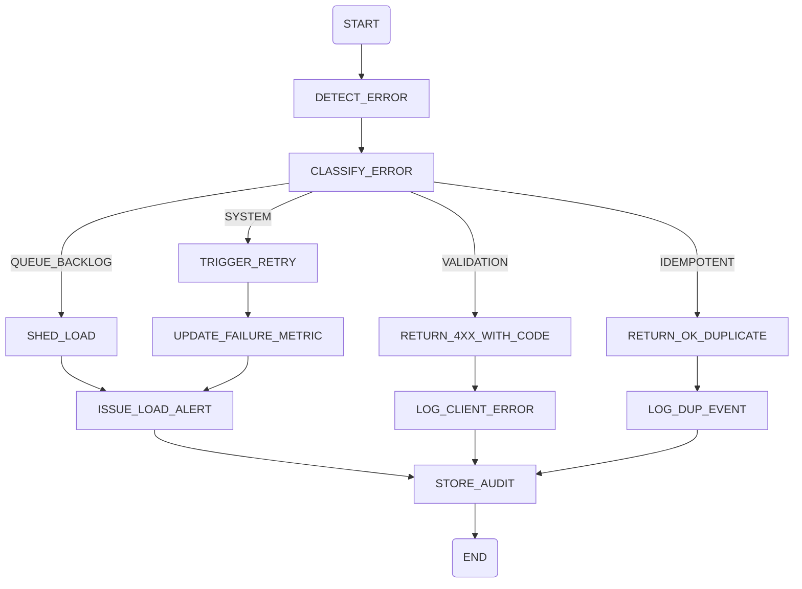

***

### 8. Deployment Architecture Design

#### 8.1 Kubernetes / Multi-Region Deployment \[UC-F-006], \[US-013], \[US-014]

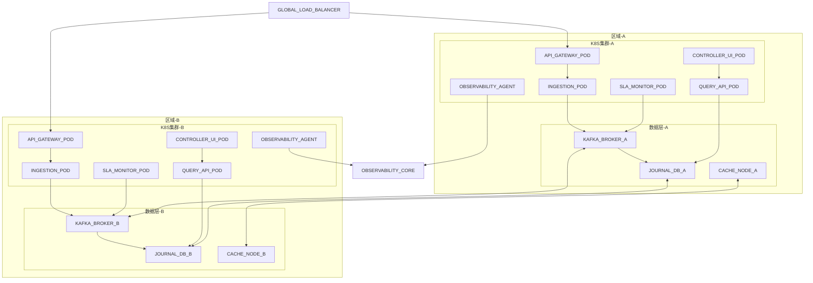

***

### 9. Security and Permissions Design

#### 9.1 Permission Control Architecture Diagram \[UC-F-005], \[US-007], \[US-008]

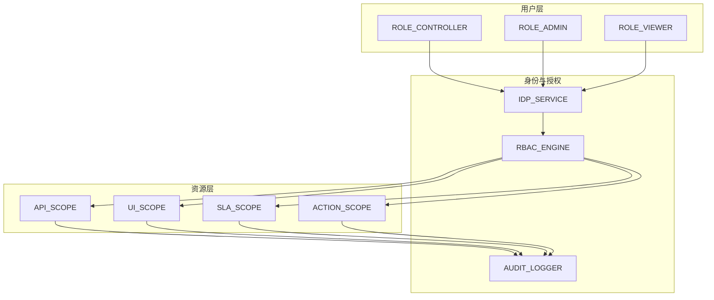

***

### 10. Operations and Monitoring Design

#### 10.1 System Monitoring Architecture Diagram \[UC-F-006], \[US-015]

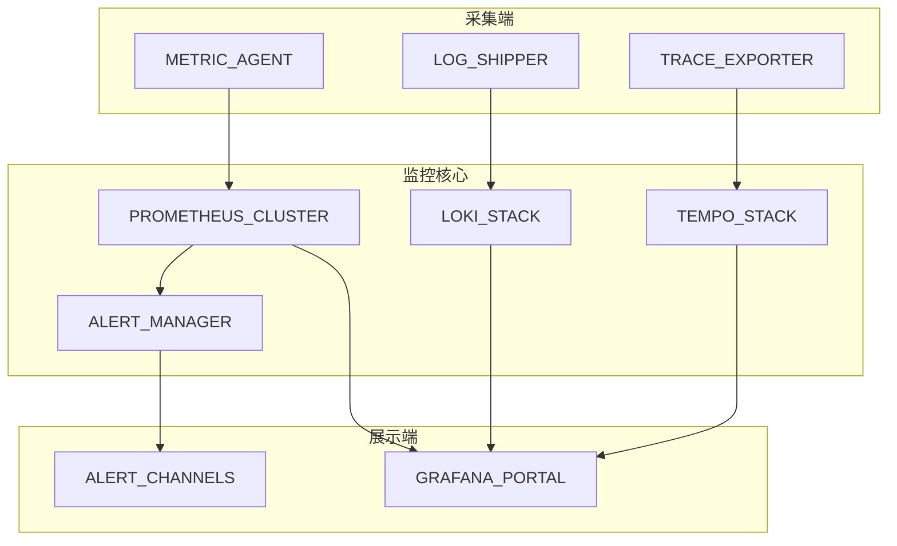

***

### 11. Architecture Diagram Index

| #  | Diagram Title                                     | Section | Mermaid Identifier              |
| -- | ------------------------------------------------- | ------- | ------------------------------- |
| 1  | System Structure Diagram                          | 2.1     | graph TD (Overall Architecture) |
| 2  | Functional Module Diagram                         | 2.2     | graph TD (Modules)              |
| 3  | Process: Обработка события статуса                | 3.1     | flowchart TD                    |
| 4  | Process: Реагирование на нарушение SLA            | 3.2     | flowchart TD                    |
| 5  | State Diagram: Статусы единицы поставки           | 4.1     | stateDiagram-v2                 |
| 6  | Sequence: Нарушение SLA и корректирующее действие | 5.1     | sequenceDiagram                 |
| 7  | Data Flow Diagram                                 | 6.1     | graph TD                        |
| 8  | Error Handling Flow                               | 7.1     | flowchart TD                    |
| 9  | Deployment Architecture (Kubernetes)              | 8.1     | graph TD                        |
| 10 | Security & Permissions Architecture               | 9.1     | graph TD                        |
| 11 | Monitoring & Observability Architecture           | 10.1    | graph TD                        |

***

#### Дополнительные замечания и рекомендации

1. **Технологический стек (предварительно):**
   * API Gateway: NGINX Ingress + Kong/Apigee
   * Event Stream: Apache Kafka (с 6+ партициями на ключи `deliveryUnitId`)
   * Хранилище журнала: PostgreSQL Citus / Apache Cassandra (зависит от требований консистентности), плюс Elasticsearch для полнотекстовых запросов UI
   * Кэш и аналитика: Redis Cluster / Aerospike
   * SLA Processing: Flink / Kafka Streams для real-time расчётов
   * Контроллер UI: React + TypeScript, SSR через Next.js по необходимости
   * Observability: Prometheus, Grafana, Loki, Tempo, OpenTelemetry SDK
   * Безопасность: OAuth2/OIDC через Keycloak/Okta, mTLS внутри сети
2. **Нефункциональные параметры:**
   * SLA сервиса: 99.95% доступности
   * RPO ≤ 5 минут для журнала, RTO ≤ 15 минут
   * Среднее время обработки события: < 200 мс (ингест), < 60 секунд до выявления нарушения SLA
   * Гарантия идемпотентности через хранение `event_id` и TTL-кэш на 24ч
3. **План расширения и устойчивости:**
   * Гео-распределённые кластеры (Active/Active) с CDC-репликацией журналов

* Авто-масштабирование ingestion и SLA-подов по нагрузке
* Категоризация нарушений и приоритизация уведомлений

4. **Трейсабилити:**
   * Модули и диаграммы покрывают требования \[PRD-2.1] и \[US-001…US-015].
   * UC-F-001…UC-F-006 соответствуют функциональным блокам PRD, создавая связку PRD → User Stories → Architecture.
